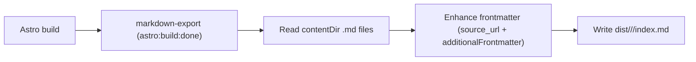

# astro-markdown-export, enables content negotiation directly from Astro to make what truly matters available to AI agents 🪵

[](https://www.npmjs.com/package/@louisbrulenaudet/astro-markdown-export)
[](https://astro.build/)
[](https://www.typescriptlang.org/)
[](https://biomejs.dev/)

An Astro integration that exports content-collection Markdown files at build time and enhances their frontmatter with optional source URLs and extra metadata. It writes route-shaped `index.md` files into your build output so bots, crawlers, AI agents, and other tools can consume the same content you serve to humans, directly from static Markdown.

### Features

- **Content collection export**: Reads `.md` files from your Astro content directory and writes `index.md` files alongside your built site.
- **Enhanced frontmatter**: Adds `source_url` entries (HTML + Markdown) plus any additional frontmatter you configure.
- **Configurable routing**: Control `contentDir`, `routePrefix`, and integration with Astro’s build output directory.
- **Slug-safe output paths**: Derives URL-friendly slugs from filenames and writes to `<outputDir>/<routePrefix>/<slug>/index.md`.
- **Concurrency & robustness**: Processes files in parallel with configurable `concurrency` and `failOnError` behavior.
- **Bot/AI friendly**: Designed for content negotiation and downstream ingestion by LLMs and crawlers.

### Tech stack

- **Framework**: Astro integration (Astro `astro:build:done` hook)
- **Language**: TypeScript (ES modules)
- **Formatting/linting**: [Biome](https://biomejs.dev/)
- **Build tooling**: [tsdown](https://github.com/egoist/tsdown) + Node.js `>=22.12.0`
- **Package manager**: pnpm (recommended)

## Installation

Install with `pnpm`:

```bash
pnpm add @louisbrulenaudet/astro-markdown-export
```

Or with npm:

```bash
npm install @louisbrulenaudet/astro-markdown-export
```

You can also use any other Node.js package manager (yarn, bun, etc.).

## Quick start

1. **Install** `@louisbrulenaudet/astro-markdown-export` in your Astro project.
2. **Add the integration** in `astro.config.mjs`.
3. **Ensure your content** lives under `src/content/blog` (or set a custom `contentDir`).
4. **Run** `astro build` and inspect the generated Markdown under `dist/<routePrefix>/<slug>/index.md`.

Minimal setup:

```ts
// astro.config.mjs
import { defineConfig } from "astro/config";
import markdownExport from "@louisbrulenaudet/astro-markdown-export";

export default defineConfig({
  site: "https://example.com",
  integrations: [markdownExport()],
});
```

After `astro build`, Markdown files from your content directory are written to:

```text
<outputDir>/<routePrefix>/<slug>/index.md
```

For example, a file `src/content/blog/my-post.md` will produce:

```text
dist/blog/my-post/index.md
```

## Configuration and options

All options are passed to `markdownExport(options)`:

```ts
markdownExport({
  contentDir: "src/content/blog",
  routePrefix: "blog",
  siteUrl: "https://example.com",
  includeSourceUrls: true,
  additionalFrontmatter: {
    generator: "astro-markdown-export",
  },
  concurrency: 10,
  failOnError: true,
});
```

### Options

| Option | Type | Default | Description |
|--------|------|---------|-------------|
| `siteUrl` | `string` | `astro.config.site` | Base URL for generated `source_url` links. Falls back to your Astro `site` value when not set. |
| `contentDir` | `string` | `"src/content/blog"` | Directory (relative to project root) containing the `.md` files to export. |
| `outputDir` | `string` | Astro build output directory | Overridden by the build output directory; only set if you need to customize where files are written. |
| `routePrefix` | `string` | `"blog"` | Path segment under the build output (e.g. `dist/<routePrefix>/<slug>/index.md`). |
| `includeSourceUrls` | `boolean` | `true` | Whether to add `source_url` (`html` and `md`) to frontmatter. |
| `additionalFrontmatter` | `Record<string, unknown>` | `{}` | Extra frontmatter keys/values (strings, numbers, booleans, arrays, nested objects) added to every exported file. |
| `concurrency` | `number` | `10` | Number of files processed in parallel. |
| `failOnError` | `boolean` | `import.meta.env.DEV` | If `true`, the build fails when processing a file throws; otherwise errors are logged and the build continues. |

### Behavior

- Runs in the `astro:build:done` hook against the configured `contentDir`.
- Input files must start with valid YAML frontmatter (`---` … `---`); files without it are skipped with a warning.
- Only `.md` files are processed (no `.mdx`).
- The original frontmatter is preserved and enhanced:
  - Optional `source_url` block when `includeSourceUrls` is `true`.
  - Any keys from `additionalFrontmatter`, including nested objects and arrays.
- Errors while processing individual files are logged; when `failOnError` is `true`, the build will fail on such errors.
- Files are processed in batches using the configured `concurrency` value to keep memory usage predictable on large content sets.

### Slug generation

- The slug is derived from the filename (e.g. `my-post.md` → `my-post`).
- Slugs are normalized to be URL-friendly (lowercased, non-alphanumeric characters replaced by `-`, trimmed).
- The final path is `<outputDir>/<routePrefix>/<slug>/index.md`.

### How `siteUrl` is resolved

- If you pass `siteUrl` in options, it is used for `source_url` generation.
- Otherwise the integration uses `astro.config.site` from your Astro configuration.

## Examples

### Blog export (default-style)

```ts
// astro.config.mjs
import { defineConfig } from "astro/config";
import markdownExport from "@louisbrulenaudet/astro-markdown-export";

export default defineConfig({
  site: "https://example.com",
  integrations: [
    markdownExport({
      contentDir: "src/content/blog",
      routePrefix: "blog",
      includeSourceUrls: true,
      additionalFrontmatter: {
        generator: "astro-markdown-export",
        content_version: 1,
      },
    }),
  ],
});
```

This exports Markdown from `src/content/blog` into `dist/blog/<slug>/index.md` with `source_url` and the extra frontmatter fields.

### Docs export

```ts
// astro.config.mjs
import { defineConfig } from "astro/config";
import markdownExport from "@louisbrulenaudet/astro-markdown-export";

export default defineConfig({
  site: "https://docs.example.com",
  integrations: [
    markdownExport({
      contentDir: "src/content/docs",
      routePrefix: "docs",
      additionalFrontmatter: {
        section: "docs",
      },
    }),
  ],
});
```

This exports Markdown from `src/content/docs` into `dist/docs/<slug>/index.md` with any additional metadata you define.

### Content negotiation with Cloudflare Workers

When you deploy an Astro site to Cloudflare (e.g. with `@astrojs/cloudflare`), you can use a custom Worker to serve the **exported Markdown** to known bots and crawlers (e.g. LLM fetchers) while serving normal HTML to everyone else. The Worker intercepts requests, detects bots via `User-Agent` and `Accept` headers, and fetches the pre-built `index.md` from your Assets binding so the same URLs return Markdown for bots and HTML for humans.

**1. Worker entry (e.g. `src/worker.ts` or your Worker entry file)**

Use `routePrefix: "blog"` in `markdownExport()` so files are at `dist/blog/<slug>/index.md`. The Worker fetches that path from `env.ASSETS` when the request looks like a bot that accepts markdown:

```ts
import { handle } from "@astrojs/cloudflare/handler";
import type { ExportedHandler } from "@cloudflare/workers-types";
import { getWorkerConfig } from "./config";
import { isAcceptingMarkdownResponse, isKnownBot } from "./utils/bot";
import { getCacheHeaders } from "./utils/cache";
import { extractSlugFromBlogPath } from "./utils/path";
import { applySecurityHeaders } from "./utils/securityHeaders";

export default {
  async fetch(
    request: Request,
    env: Env,
    ctx: ExecutionContext,
  ): Promise<Response> {
    const workerConfig = getWorkerConfig(env);
    const ua = request.headers.get("user-agent");
    const acceptHeader = request.headers.get("accept");
    const url = new URL(request.url);
    const pathname = url.pathname;

    if (request.method === "POST" && pathname === "/report") {
      return new Response(null, { status: 204 });
    }

    if (isKnownBot(ua) && isAcceptingMarkdownResponse(acceptHeader)) {
      const slug = extractSlugFromBlogPath(pathname);
      if (slug) {
        const markdownUrl = new URL(`/blog/${slug}/index.md`, url.origin);
        const markdownResponse = await env.ASSETS.fetch(markdownUrl, {
          cf: {
            cacheTtl: workerConfig.cacheTtl,
            cacheEverything: true,
          },
        });

        if (markdownResponse.ok) {
          const headers = new Headers(markdownResponse.headers);
          headers.set("Content-Type", "text/markdown; charset=utf-8");
          applySecurityHeaders(headers, pathname);
          return new Response(markdownResponse.body, {
            status: markdownResponse.status,
            statusText: markdownResponse.statusText,
            headers,
          });
        }
      }
    }

    const response = await handle(request, env, ctx);
    const headers = new Headers(response.headers);
    applySecurityHeaders(headers, pathname);

    const cacheHeaders = getCacheHeaders(pathname);
    if (cacheHeaders["Cache-Control"]) {
      headers.set("Cache-Control", cacheHeaders["Cache-Control"]);
    }
    if (cacheHeaders["CDN-Cache-Control"]) {
      headers.set("CDN-Cache-Control", cacheHeaders["CDN-Cache-Control"]);
    }

    return new Response(response.body, {
      status: response.status,
      statusText: response.statusText,
      headers,
    });
  },
} satisfies ExportedHandler<Env>;
```

**2. Bot detection – user agents (e.g. `src/worker/enums/userAgents.ts`)**

```ts
export enum UserAgents {
  CHATGPT_USER = "ChatGPT-User",
  DUCK_ASSIST_BOT = "DuckAssistBot",
  META_EXTERNAL_FETCHER = "Meta-ExternalFetcher",
  MISTRAL_AI_USER = "MistralAI-User",
  PERPLEXITY_USER = "Perplexity-User",
  PETALBOT = "PetalBot",
  GPTBOT = "GPTBot",
  META_EXTERNAL_AGENT = "Meta-ExternalAgent",
  AMAZONBOT = "Amazonbot",
  BYTESPIDER = "Bytespider",
  CLAUDE_BOT = "ClaudeBot",
  CC_BOT = "CCBot",
  ANCHOR_BROWSER = "Anchor Browser",
  CLAUDE_SEARCH_BOT = "Claude-SearchBot",
  CLAUDE_USER = "Claude-User",
  FACEBOOK_BOT = "FacebookBot",
  GOOGLE_CLOUD_VERTEX_BOT = "Google-CloudVertexBot",
  NOVELLUM_AI_CRAWL = "Novellum AI Crawl",
  PRO_RATA_INC = "ProRataInc",
  TIMPIBOT = "Timpibot",
  APPLEBOT = "Applebot",
  OAI_SEARCH_BOT = "OAI-SearchBot",
  PERPLEXITY_BOT = "PerplexityBot",
}

export const BOT_TOKENS = Object.values(UserAgents);
```

**3. Bot detection – utils (e.g. `src/worker/utils/bot.ts`)**

```ts
import { BOT_TOKENS } from "../enums/userAgents";

function escapeRegex(token: string): string {
  return token.replace(/[.*+?^${}()|[\]\\]/g, "\\$&");
}

const BOT_RE = new RegExp(BOT_TOKENS.map(escapeRegex).join("|"), "i");

export function isKnownBot(ua: string | null): boolean {
  return ua !== null && BOT_RE.test(ua);
}

export function isAcceptingMarkdownResponse(
  acceptHeader: string | null,
): boolean {
  return (
    acceptHeader !== null &&
    (acceptHeader.includes("text/markdown") ||
      acceptHeader.includes("text/plain"))
  );
}
```

**4. Path helper**

Extract the blog slug from paths like `/blog/my-post` or `/blog/my-post/` so you can request `/blog/my-post/index.md` from Assets (the path where `astro-markdown-export` writes the file when `routePrefix` is `"blog"`):

```ts
const BLOG_PREFIX = "/blog/";

export function extractSlugFromBlogPath(pathname: string): string | null {
  if (!pathname.startsWith(BLOG_PREFIX)) return null;
  const segment = pathname.slice(BLOG_PREFIX.length).replace(/\/$/, "");
  if (!segment || segment.includes("/")) return null;
  return segment;
}
```

**5. Wrangler configuration (asset binding)**

Use a Workers configuration that binds your built output (including the exported Markdown) to `ASSETS` and runs the Worker first for `/blog/*` and `/report`, so the Worker can serve Markdown to bots before falling back to static assets. Example `wrangler.jsonc`:

```jsonc
{
  "name": "astro-frontend",
  "main": "./src/worker/index.ts",
  "compatibility_date": "2026-01-20",
  "compatibility_flags": [
    "nodejs_compat",
    "global_fetch_strictly_public",
    "no_handle_cross_request_promise_resolution"
  ],
  "assets": {
    "binding": "ASSETS",
    "directory": "./dist",
    "html_handling": "drop-trailing-slash",
    "run_worker_first": ["/blog/*", "/report"],
    "not_found_handling": "404-page"
  },
  "placement": { "mode": "smart" }
}
```

- **`assets.binding`**: `"ASSETS"` is the name your Worker uses (`env.ASSETS`) to fetch static files, including `dist/blog/<slug>/index.md` produced by `astro-markdown-export`.
- **`assets.directory`**: `"./dist"` — the Astro build output (and thus the Markdown export output).
- **`assets.run_worker_first`**: `["/blog/*", "/report"]` ensures the Worker runs for blog and report routes so you can do content negotiation for `/blog/<slug>` before serving HTML from assets.

Implement `getWorkerConfig`, `getCacheHeaders`, and `applySecurityHeaders` in your project as needed. Ensure your Astro config uses `markdownExport({ routePrefix: "blog" })` (or the same prefix you use in the Worker) so the Worker’s `/blog/<slug>/index.md` URLs match the built assets.

## Build-time flow



## Usage tips and best practices

- **Set `astro.config.site`** so `source_url` entries are correct, especially in production builds.
- **Expose the generated Markdown** under predictable routes, e.g. `/blog/<slug>/index.md`, and document them for consumers (bots, AI agents, internal tools).
- **Use `additionalFrontmatter`** for cross-cutting metadata (e.g. generator name, content version, license hints) that apply to all exported files.

## Development and testing

For contributing to this package:

- **Build**: `pnpm build` – bundle `src/index.ts` to `dist/` with tsdown.
- **Tests**: `pnpm test` (watch mode) or `pnpm test:run` (single run) using Vitest.
- **Type checking**: `pnpm check-types`.
- **Formatting/linting**: `pnpm format`, `pnpm lint`, or `pnpm check` (Biome).

## Links and license

- **GitHub**: [`louisbrulenaudet/astro-markdown-export`](https://github.com/louisbrulenaudet/astro-markdown-export)
- **npm**: [`@louisbrulenaudet/astro-markdown-export`](https://www.npmjs.com/package/@louisbrulenaudet/astro-markdown-export)


